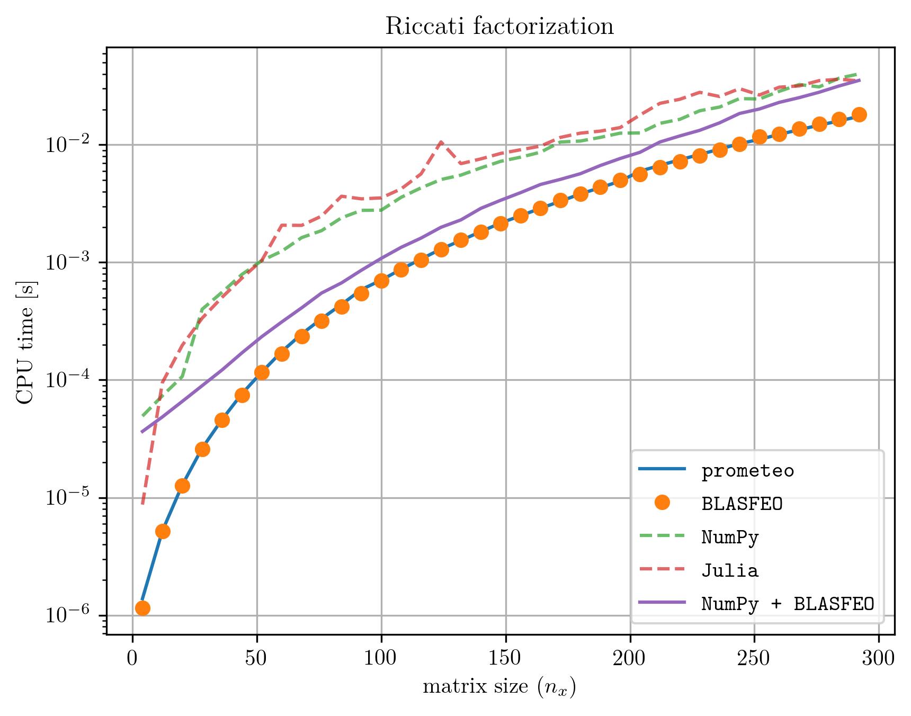

Performance
===========

Since prometeo programs transpile to pure C code that calls the high performance linear algebra library BLASFEO (`publication <https://arxiv.org/abs/1704.02457>`__, `code <https://github.com/giaf/blasfeo>`__), execution time can be comparable to hand-written high-performance code. The figure below shows a comparison of the CPU time necessary to carry out a Riccati factorization using highly optimized hand-written C code with calls to BLASFEO and the ones obtained with prometeo transpiled code from `this example <https://github.com/zanellia/prometeo/blob/master/examples/riccati_example/riccati_mass_spring.py>`__). The computation times obtained with NumPy and Julia are added too for comparison - notice however that these last two implementations of the Riccati factorization are **not as easily embeddable** as the C code generated by prometeo and the hand-coded C implementation. All the benchmarks have been run on a Dell XPS-9360 equipped with an i7-7560U CPU running at 2.30 GHz (to avoid frequency fluctuations due to thermal throttling). 

